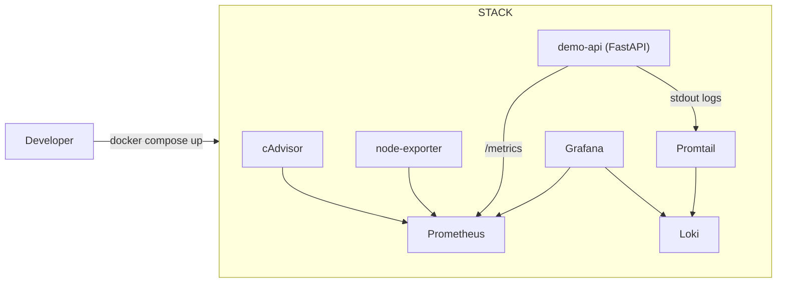

# OrbitOps Observability Stack - Prometheus + Grafana + Loki (Docker Compose)

A **portfolio-grade observability project** that brings up a complete local monitoring + logging stack in one command.

It showcases **DevOps/Platform fundamentals**: reproducible environments, service health checks, metrics collection,
log aggregation, and a clean runbook.

---

## What this showcases

- **Docker Compose** stack with:
  - **Prometheus** (metrics)
  - **Grafana** (dashboards)
  - **Loki + Promtail** (logs)
  - **node-exporter** (host metrics)
  - **cAdvisor** (container metrics)
  - **demo API** instrumented with Prometheus metrics
- **Provisioned Grafana** datasources (Prometheus + Loki) on startup
- **Health checks + smoke test** script
- **CI**: validates Compose + builds the demo image + runs quick smoke checks

---

## Architecture



---

## Quickstart

### 1) Start the stack

```bash
docker compose up --build
```

### 2) Open Grafana

- Grafana: http://localhost:3000
- Login: **admin / admin** (you’ll be prompted to change it)

### 3) Verify endpoints

- API health: http://localhost:8000/healthz
- API metrics: http://localhost:8000/metrics
- Prometheus: http://localhost:9090

### 4) Stop

```bash
docker compose down -v
```

---

## Smoke test

In another terminal:

```bash
./scripts/smoke_test.sh
```

What it checks:
- API health is OK
- Prometheus is reachable
- Grafana is reachable

---

## Repo structure

```
demo_api/                     # instrumented FastAPI service
observability/                # Prometheus/Loki/Promtail config
grafana/provisioning/         # auto-provisioned datasources
scripts/                      # smoke test script
.github/workflows/            # CI
docker-compose.yml            # full stack
```

---

## Resume angle (what to claim)

- Built a reproducible **observability stack** (metrics + logs) with Docker Compose
- Instrumented a service with Prometheus metrics and validated visibility via Grafana datasources
- Added health checks + smoke tests to keep the environment reviewable and reliable

---

## Roadmap ideas (optional upgrades)

- Add a pre-built Grafana dashboard JSON (CPU, memory, request rate)
- Add Alertmanager + sample alert rules
- Add TLS/Ingress examples for Kubernetes
